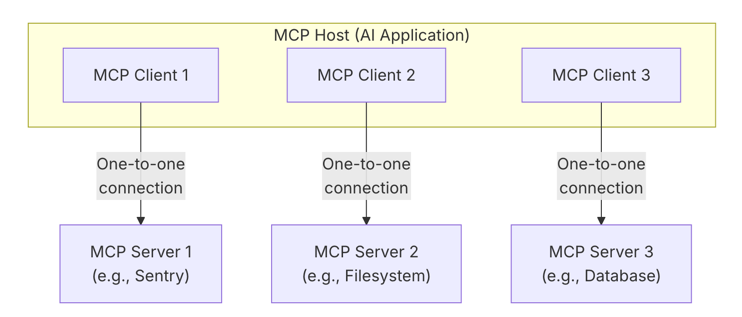

## 讲述 IFC 模块的设计


### Overview


MCP的架构可能稍稍有些不同，但本质上还是一样的
这里可以借鉴：
1. MCP本身的架构图
2. MCP安全的架构图(https://arxiv.org/pdf/2503.23278)
3. camel的架构图

官方给的MCP架构图



论文 Model Context Protocol (MCP): Landscape, Security Threats,
and Future Research Directions 中给的架构图：


- MCP Host: The AI application that coordinates and manages one or multiple MCP clients
- MCP Client: A component that maintains a connection to an MCP server and obtains context from an MCP server for the MCP host to use
- MCP Server: A program that provides context to MCP clients

client - server 是 one-to-one，**也就是说 Planner 其实可以设计多个？？？**
这里是不是有效率上的考虑？设计不同的Planner.

**TODO:
值得探索的点：planner的自动选择？根据权限？（权限的设计）**


如何处理 camel agent

**TODO:** 根据这个设计我自己的 Loop.
我也要把 dual model 加进去，来实现 security check.


### 形式化
先定义我有什么
多了 client，还是多个，是一个集合
相当于只需要考虑

不同的client 中的 Q-LLM 和 P-LLM 需不需要特殊设计？
污点的来源，外部，内部？？？


- the Quarantined LLM: an LLM tasked with parsing unstructured data to structured data;
- the Privileged LLM: an LLM generating code that expresses the user query;
- tools: subroutines which can be invoked by the system to execute specific tasks via predefined
APIs (e.g., a tool to send an email);
- security policies: functions that define what is and what is not allowed when calling tools;
- capabilities: tags assigned to each value that are used to store the value’s sources and allowed
readers;
- the CaMeL interpreter: an orchestrator interpreting the code written by the Privileged LLM,
propagating capabilities, and enforcing security policies.


从整体上来看 好像只有 Quarantined LLM
比较需要优化？？？
提前拒绝？？？根据MCP 减少 Q-LLM的调用次数


```text
dualflow(prompt, mcp, mem, plicies)


# 能证明从MCP上加一些操作，可以减小开销吗？？？

tools <- tools ∪ Q-LLM
plan <- P-LLM.plan(prompt, tools)  # 这行比较重要，能不能根据选择不同的plan

for (tool, args) ∈ plan do
    if policies.check(tool, args, mem) =⊥ then
        return Trace
    mem ← tool(args, mem)
    Trace ← Trace ∪ (tool, args, mem)
return Trace


```


从调用图的角度？？？

#### Policy Engine的位置
感觉实现这个还是需要 dual model???
Dual Model 的思想
转化为代码？？？
camel???


**TODO: 扫描后给个权限自动分配，即扫描后给个结果**
#### 标签
**TODO:** 给Server打标签后，还需要考虑 Server 下的tool吗？

### 实现
- dual model（先不考虑）
- 现在一个client中实现最基本的 planner
- 之后再去考虑别的
